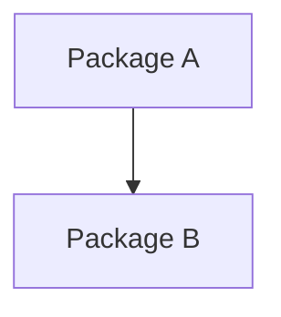
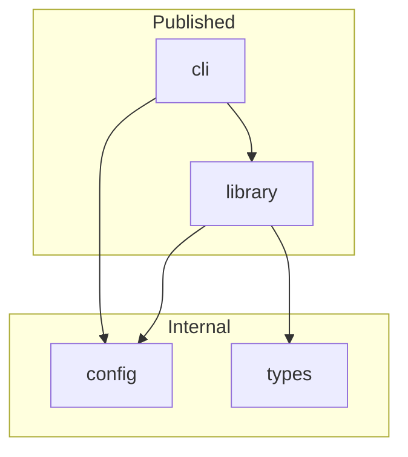
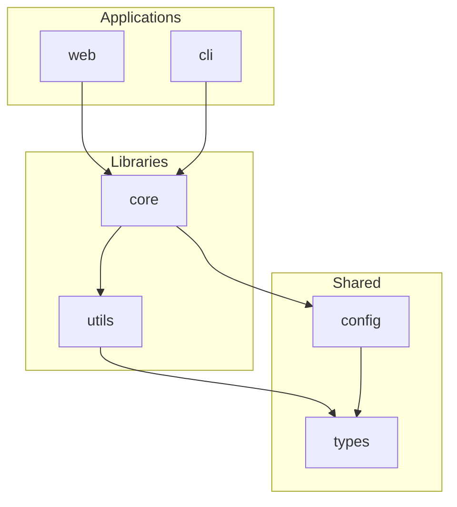
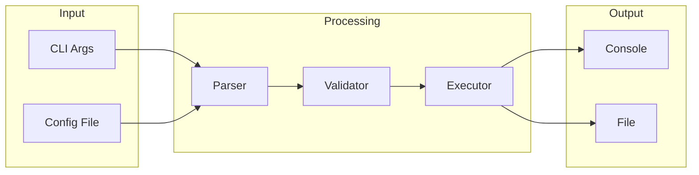
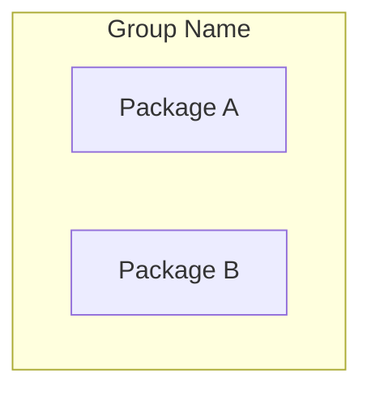

# Architecture Diagrams for Monorepos

## Why Architecture Diagrams

Monorepos need visual explanation because:
- Package relationships aren't obvious from file structure
- Dependency direction matters for understanding
- New contributors need orientation quickly

## Mermaid Basics

Use Mermaid for diagrams that render on GitHub:

````markdown

````

## Common Patterns

### Package Dependency Graph

Show which packages depend on which:

````markdown

````

### Layered Architecture

Show packages in layers:

````markdown

````

### Data Flow

Show how data moves through packages:

````markdown

````

## Package Table with Descriptions

Complement the diagram with a table:

```markdown
## Packages

| Package | Description | Dependencies |
|---------|-------------|--------------|
| `cli` | Command-line interface | library, config |
| `library` | Core functionality | types, config |
| `config` | Shared configuration | types |
| `types` | TypeScript types | (none) |
```

## Diagram Best Practices

### Do

- Show only direct dependencies
- Group related packages
- Label with package names, not paths
- Keep it simple (under 10 nodes)

### Don't

- Show transitive dependencies
- Include devDependencies
- Make it too detailed
- Use complex styling

## When Diagrams Help vs When They Don't

### Diagrams Help When

- More than 3 packages
- Non-obvious relationships
- Layered architecture
- External dependencies matter

### Diagrams Don't Help When

- Only 1-2 packages
- Linear dependency chain
- Packages are unrelated
- Diagram would be trivial

## Alternative Visualizations

### ASCII Art (for simple cases)

```
┌──────────┐
│   cli    │
└────┬─────┘
     │
     ▼
┌──────────┐
│ library  │
└────┬─────┘
     │
     ▼
┌──────────┐
│  config  │
└──────────┘
```

### Table-Based (for many packages)

When you have many packages, a table may be clearer:

```markdown
| Package | Depends On |
|---------|------------|
| cli | library, config |
| library | types, config |
| web | library, ui |
| ui | types |
| config | types |
| types | (none) |
```

## Keeping Diagrams Updated

### Manual Updates

Update diagram when:
- Adding new package
- Changing dependencies
- Reorganizing structure

### Automated Generation

Use tools to generate from actual dependencies:

```bash
# Using dependency-cruiser
npx depcruise --output-type dot packages | dot -T svg > deps.svg

# Using madge
npx madge --image deps.svg packages/
```

## Mermaid Tips

### Subgraphs for Grouping



### Direction Control

- `TB` or `TD`: Top to bottom
- `BT`: Bottom to top
- `LR`: Left to right
- `RL`: Right to left

### Node Shapes

- `[Text]`: Rectangle
- `(Text)`: Rounded rectangle
- `{Text}`: Diamond
- `((Text))`: Circle

### Link Styles

- `-->`: Arrow
- `---`: Line
- `-.->`: Dotted arrow
- `==>`: Thick arrow
