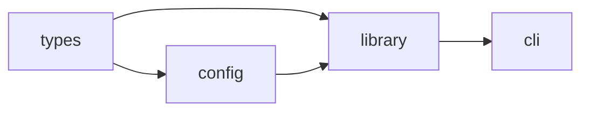

# Monorepo Publishing Documentation

## Document the Publishing Workflow

README should explain:
1. How packages are versioned
2. How to release
3. CI/CD involvement
4. Who can publish

## Versioning Strategies

### Fixed/Locked Versioning

All packages share the same version:

```markdown
## Versioning

All packages are versioned together. When any package changes,
all packages receive the same version bump.

Current version: See [package.json](./package.json)
```

### Independent Versioning

Each package has its own version:

```markdown
## Versioning

Packages are versioned independently based on their changes.
See each package's CHANGELOG for version history.

| Package | Version |
|---------|---------|
| @scope/cli | 2.1.0 |
| @scope/lib | 1.5.3 |
| @scope/config | 1.0.0 |
```

## Build Order

Document the correct build order:

```markdown
## Build Order

Packages must be built in dependency order:

1. `types` (no dependencies)
2. `config` (depends on types)
3. `library` (depends on types, config)
4. `cli` (depends on library, config)

Run `npm run build` to build all in correct order.
```

Or use a diagram:

````markdown

````

## Workspace Commands

Document workspace-specific npm commands:

```markdown
## Workspace Commands

### Build All

\`\`\`bash
npm run build
\`\`\`

### Build Specific Package

\`\`\`bash
npm run build -w @scope/cli
\`\`\`

### Test All

\`\`\`bash
npm test
\`\`\`

### Test Specific Package

\`\`\`bash
npm test -w @scope/library
\`\`\`

### Run Script in All Packages

\`\`\`bash
npm run lint --workspaces
\`\`\`
```

## Release Process

Document the release workflow:

```markdown
## Releasing

### Prerequisites

- All tests passing
- On `main` branch
- No uncommitted changes

### Steps

1. **Update versions**
   \`\`\`bash
   npm version minor --workspaces
   \`\`\`

2. **Build all packages**
   \`\`\`bash
   npm run build
   \`\`\`

3. **Run tests**
   \`\`\`bash
   npm test
   \`\`\`

4. **Publish**
   \`\`\`bash
   npm publish --workspaces
   \`\`\`

5. **Push tags**
   \`\`\`bash
   git push --tags
   \`\`\`
```

## CI/CD Documentation

Explain what CI does:

```markdown
## CI/CD

### On Pull Request

- Lint all packages
- Type-check all packages
- Run all tests
- Build all packages

### On Merge to Main

- All PR checks
- Publish to npm (if version changed)
- Deploy docs (if docs changed)

### Release Workflow

Releases are triggered by:
1. Creating a GitHub release
2. CI builds and publishes to npm
3. Docs are updated automatically
```

## npm Workspace Tips

Document workspace-specific knowledge:

```markdown
## npm Workspaces

This project uses [npm workspaces](https://docs.npmjs.com/cli/using-npm/workspaces).

### Installing Dependencies

\`\`\`bash
# Install dependency in specific package
npm install lodash -w @scope/library

# Install dev dependency in root
npm install -D typescript
\`\`\`

### Running Scripts

\`\`\`bash
# Run in specific package
npm run build -w @scope/cli

# Run in all packages
npm run build --workspaces

# Run in all packages (shorthand)
npm run build -ws
\`\`\`

### Cleaning

\`\`\`bash
# Remove all node_modules
rm -rf node_modules packages/*/node_modules

# Reinstall
npm install
\`\`\`
```

## Changesets (If Used)

If using changesets for versioning:

```markdown
## Changesets

We use [changesets](https://github.com/changesets/changesets) for versioning.

### Adding a Changeset

When you make a change that should be released:

\`\`\`bash
npx changeset
\`\`\`

Follow the prompts to describe your change.

### Releasing

On merge to main, a PR is created to release changed packages.
Merging that PR publishes to npm.
```

## Private Packages

Document which packages are private:

```markdown
## Package Visibility

| Package | Published | Description |
|---------|-----------|-------------|
| @scope/cli | Yes | Public CLI tool |
| @scope/library | Yes | Public library |
| @scope/config | No | Internal config (private: true) |
| @scope/types | No | Internal types (private: true) |
```

## Troubleshooting Publishing

Common issues and solutions:

```markdown
## Publishing Troubleshooting

### "npm ERR! 403 Forbidden"

You don't have permission to publish. Check:
- You're logged in: `npm whoami`
- You have publish rights to the scope
- The package name isn't taken

### "npm ERR! 402 Payment Required"

Scoped packages are private by default. Either:
- Pay for npm private packages, or
- Add `--access public` to publish command

### Version Already Exists

You can't republish a version. Bump the version:
\`\`\`bash
npm version patch -w @scope/package
\`\`\`
```
