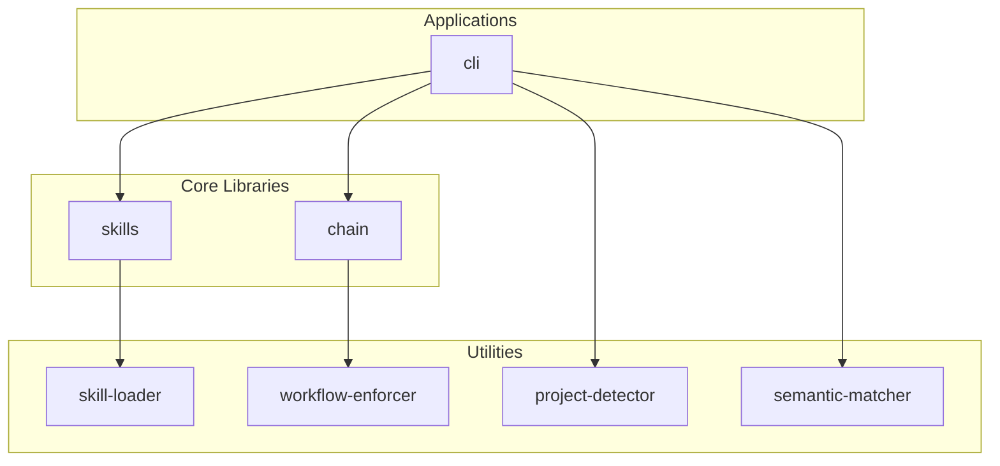

# Claude Code Skills

Intelligent skill discovery and workflow enforcement for Claude Code.

[](https://npmjs.com/package/@4meta5/skills-cli)
[](https://opensource.org/licenses/MIT)

```bash
npx @4meta5/skills-cli scan
```

## Table of Contents

- [What It Does](#what-it-does)
- [Quick Start](#quick-start)
- [Why Skills?](#why-skills)
- [Claudette Baseline Requirements](#claudette-baseline-requirements)
- [Architecture](#architecture)
- [Features](#features)
- [How Skills Get Activated](#how-skills-get-activated)
- [CLI Reference](#cli-reference)
- [Skill Format](#skill-format)
- [Configuration](#configuration)
- [Packages](#packages)
- [Contributing](#contributing)
- [Skills Library](#skills-library)

## What It Does

**Skills** are reusable prompts that activate when needed. This CLI:

1. **Scans your project** and recommends relevant skills based on your tech stack
2. **Installs skills** to a flat `.claude/skills/` directory
3. **Tracks provenance** to distinguish custom skills from upstream sources
4. **Routes prompts** to the right skill using semantic matching
5. **Enforces workflows** like TDD and code review automatically

## Quick Start

```bash
# Run without installing (recommended)
npx @4meta5/skills-cli scan

# Or install globally
npm install -g @4meta5/skills-cli

# Scan your project for recommended skills
skills scan

# Install all high-confidence recommendations
skills scan --all

# List installed skills
skills list

# Add a specific skill
skills add tdd
```

## Why Skills?

Claude Code loads skills from `.claude/skills/` directories. Finding the right skills is hard. You need to know what exists, evaluate quality, and keep them updated.

This CLI solves that:

| Problem | Solution |
|---------|----------|
| "What skills should I use?" | `skills scan` analyzes your project |
| "Where do I find skills?" | Built-in library + curated community sources |
| "Are these skills any good?" | Confidence scoring and deduplication |
| "How do I install them?" | `skills add name` or `skills scan --all` |
| "Which skills did I write?" | `skills list --custom` filters by provenance |

## Claudette Baseline Requirements

These skills and commands are required by Claudette and must remain stable.

### Required Skills (6)

These skills are canonical in `skills/` and bundled into `packages/skills/skills/` during publish:

| Skill | Purpose | Bundled |
|-------|---------|---------|
| `tdd` | Test-driven development workflow | Yes |
| `no-workarounds` | Prevents manual workarounds when building tools | Yes |
| `suggest-tests` | Recommend tests based on git diff | Yes |
| `unit-test-workflow` | Multi-phase test generation | Yes |
| `repo-hygiene` | Clean auto-generated test artifacts | No (root-only) |
| `code-review` | Code review guidelines | Yes |

**Note:** `repo-hygiene` lives only in `skills/` and is not bundled with the npm package. Users who need it should install via `skills add repo-hygiene`.

### Required Hooks

| Hook | Purpose |
|------|---------|
| `skill-forced-eval` | Forces skill evaluation on every prompt |
| `usage-tracker` | Logs skill activations (optional but recommended) |
| `semantic-router` | Routes prompts to skills (optional) |

### Required CLI Commands

```bash
skills scan                   # Analyze project, recommend skills
skills add <name>             # Install a skill
skills list                   # List installed skills
skills hook add/list/remove   # Manage hooks
skills stats                  # Usage analytics
skills validate [path]        # Validate skill format (defaults to all skills)
```

### Stable Interfaces

- **SKILL.md format**: Must remain compatible with current spec
- **skill-loader**: Loading and parsing must remain stable
- **Chain enforcement**: Workflow enforcement via hooks/chain must remain available

## Architecture

This monorepo contains 7 packages organized in layers:



| Package | Description |
|---------|-------------|
| `@4meta5/skills-cli` | CLI for scanning, installing, and managing skills |
| `@4meta5/skills` | Core library for loading and managing skills |
| `@4meta5/chain` | Skill chaining system with DAG resolution |
| `@4meta5/skill-loader` | Parse and load SKILL.md files |
| `@4meta5/project-detector` | Detect project technology stack |
| `@4meta5/semantic-matcher` | Hybrid keyword + embedding matching |
| `@4meta5/workflow-enforcer` | State machine for workflow enforcement |

## Features

### Project Analysis

Detects your tech stack automatically:

- **Languages**: TypeScript, Python, Rust, Go
- **Frameworks**: React, Vue, Svelte, Next.js, SvelteKit
- **Databases**: Postgres, MongoDB, Prisma, Drizzle
- **Testing**: Vitest, Jest, Pytest, Playwright
- **Deployment**: AWS, Cloudflare, Vercel

### Skill Matching

Maps your stack to relevant skills with confidence levels:

```
HIGH   tdd                    Testing workflow enforcement
HIGH   typescript-strict      TypeScript best practices
MEDIUM security-analysis      Security review for PRs
LOW    aws-cdk                AWS CDK patterns (detected: cloudflare)
```

### Semantic Routing

Skills activate based on context, not manual invocation. The router uses:

- **Intent mapping**: Detects task intent (fix bug, add feature, refactor) from prompt
- **Keyword matching**: Fast matching against skill trigger conditions
- **Embedding similarity**: Vector-based semantic matching for fuzzy matches
- **RRF fusion**: Combines multiple signals with Reciprocal Rank Fusion

### Skill Chaining

Skills chain together using the declarative chain system in `packages/chain/`.

**How it works:**
1. Define skills with capabilities they provide/require in `chains/skills.yaml`
2. Define workflow profiles in `chains/profiles.yaml`
3. Chain system resolves skill order using DAG-based resolution
4. Hooks enforce prerequisites before allowing tools

**Commands:**
```bash
chain validate              # Validate YAML specs
chain resolve --profile X   # Show resolved skill chain
chain status                # Show current chain progress
chain activate --profile X  # Activate a workflow
chain next                  # Show next step in chain
chain clear                 # Clear active session
```

**Features:**
- DAG-based skill resolution with dependency tracking
- Enforcement tiers (hard/soft/none) for workflow control
- Unified session state and usage tracking
- Pre-tool-use hooks for corrective guidance
- Intent mapping for smart skill activation
- Polyglot test runner discovery

## How Skills Get Activated

Skills don't activate by magic. They need hooks.

Claude Code supports "hooks" that run shell scripts when certain events happen. This CLI provides three hooks that make skills work:

| Hook | What It Does |
|------|--------------|
| `skill-forced-eval` | Injects a prompt forcing Claude to evaluate and activate relevant skills |
| `semantic-router` | Matches your prompt to skills using embeddings, suggests or forces activation |
| `usage-tracker` | Logs skill activations to `~/.claude/usage.jsonl` for analytics |

### Installing Hooks

```bash
# See available hooks
skills hook available

# Install all three
skills hook add skill-forced-eval semantic-router usage-tracker

# Check what's installed
skills hook list
```

This creates hooks in `hooks/` (with a symlink at `.claude/hooks/`) and configures `.claude/settings.local.json` to run them on every prompt.

### How Each Hook Works

**skill-forced-eval**: Runs on every prompt. Calls `skills evaluate` to generate a list of installed skills with their triggers. Injects this into the conversation as a "mandatory activation sequence" that forces Claude to:
1. Evaluate each skill (YES/NO with reason)
2. Call `Skill(name)` for every YES
3. Only then proceed with implementation

**semantic-router**: Uses vector embeddings to score your prompt against skill descriptions. If similarity > 0.85, forces activation. If 0.70-0.85, suggests activation. Below 0.70, stays silent.

**usage-tracker**: Logs events like `prompt_submitted`, `session_start`, `skill_activated` to a JSONL file. Use `skills stats` to analyze.

### Without Hooks

If you skip hooks, skills still exist in `.claude/skills/` but Claude won't automatically know to use them. You'd have to manually invoke them with `/skill-name` or hope Claude reads the CLAUDE.md references.

## CLI Reference

| Command | Description |
|---------|-------------|
| `scan` | Analyze project, recommend skills |
| `scan --all` | Install all high-confidence recommendations |
| `scan --show-alternatives` | Show all matches, not just top per category |
| `add <name>` | Install a skill by name |
| `add <name> from <source>` | Install from a specific source |
| `list` | List installed skills |
| `list --custom` | List only custom skills (no git provenance) |
| `list --upstream` | List only upstream skills (git provenance) |
| `list --provenance` | Show provenance type for each skill |
| `show <name>` | Display skill details |
| `remove <name>` | Uninstall a skill |
| `update --check` | Check for upstream skill updates |
| `update <name>` | Update a skill from its source |
| `update --all` | Update all upstream skills |
| `hygiene scan` | Detect auto-generated test slop |
| `hygiene clean --confirm` | Delete detected slop |
| `claudemd sync` | Sync CLAUDE.md with installed skills |
| `hook available` | List bundled hooks |
| `hook add <names>` | Install hooks to project |
| `hook list` | List installed hooks |
| `hook remove <names>` | Remove hooks from project |
| `evaluate` | Generate skill evaluation prompt (used by hooks) |
| `source list` | List configured skill sources |
| `source add <url>` | Add a skill repository |
| `stats` | Show usage analytics |
| `validate [path]` | Validate skill format and quality (defaults to all skills) |

## Skill Format

Skills are Markdown files with YAML frontmatter:

```markdown
---
name: my-skill
description: What this skill does and when to use it
category: testing
---

# My Skill

Instructions for Claude when this skill activates.

## When to Use

- Trigger condition 1
- Trigger condition 2

## How to Apply

Step-by-step guidance...
```

See the `skill-maker` skill for the full specification.

### How Skills Are Recognized

A skill is any folder with a `SKILL.md` file. **All skills live in the root `skills/` directory** (canonical location):

```
skills/                       ← Canonical skill location (single source of truth)
├── tdd/
│   └── SKILL.md              ← This makes it a skill
├── code-review/
│   └── SKILL.md
└── my-custom-skill/
    ├── SKILL.md              ← Required
    └── references/           ← Optional supporting files

.claude/
└── skills -> ../skills       ← Symlink for Claude Code compatibility
```

**Key points:**
- All skills (bundled and custom) live in `skills/` at root
- The `.claude/skills/` symlink makes them available to Claude Code
- The npm package build copies bundled skills from `skills/` via `scripts/sync-skills.sh`
- Never create skills in `packages/skills/skills/` directly (it's generated at build time)

**Windows users**: Recreate the symlink with admin privileges:
```cmd
mklink /D .claude\skills ..\skills
```

That's it. No registration. No config. Just `SKILL.md`.

### How Provenance Works

`.provenance.json` is optional metadata. It tracks where a skill came from.

**When the CLI installs a skill from a source**, it creates `.provenance.json`:

```json
{
  "source": {
    "type": "git",
    "url": "https://github.com/...",
    "path": "plugins/skill-name/skills/skill-name",
    "ref": "main",
    "commit": "abc123..."
  },
  "installed": { "at": "2024-01-15T...", "by": "skills-cli@1.0.0" }
}
```

**When you create a skill yourself**, there's no `.provenance.json`. The CLI treats missing provenance as "custom".

The logic is simple:
- Has `.provenance.json` with `type: "git"`? → upstream skill
- Has `.provenance.json` with `type: "custom"`? → custom skill
- No `.provenance.json` at all? → custom skill (default)

Use `skills list --provenance` to see which is which.

### Updating Skills

Skills with `upstream` origin can be updated from their source:

```bash
# Check for updates
skills update --check

# Update with security review
skills update property-based-testing --review

# Update all upstream skills
skills update --all --review
```

Security review assesses risk using differential-review:
- **LOW**: Documentation changes
- **MEDIUM**: New files, import changes
- **HIGH**: Scripts, external calls, permissions (requires `--yes`)

## Configuration

### Directory Locations

| Location | Purpose |
|----------|---------|
| `skills/` | Project-level skills (canonical location) |
| `.claude/skills/` | Symlink to `skills/` (Claude Code compatibility) |
| `hooks/` | Hook scripts for skill activation (canonical location) |
| `.claude/hooks/` | Symlink to `hooks/` (Claude Code compatibility) |
| `~/.claude/skills/` | User-level skills (shared across projects) |
| `.claude/settings.local.json` | Local Claude Code settings (gitignored) |
| `~/.claude/usage.jsonl` | Usage analytics (if tracker enabled) |

### Environment Variables

| Variable | Description |
|----------|-------------|
| `SKILLS_DEBUG` | Enable debug logging |
| `NO_COLOR` | Disable colored output |

### Skill Sources

Configure skill sources with `skills source`:

```bash
# List configured sources
skills source list

# Add a source
skills source add https://github.com/trailofbits/skills

# Sources are stored in ~/.claude/sources.json
```

## Packages

This monorepo contains 7 packages. See [Architecture](#architecture) for the dependency graph.

| Package | Path | npm |
|---------|------|-----|
| `@4meta5/skills-cli` | `packages/cli` | [](https://npmjs.com/package/@4meta5/skills-cli) |
| `@4meta5/skills` | `packages/skills` | [](https://npmjs.com/package/@4meta5/skills) |
| `@4meta5/chain` | `packages/chain` | [](https://npmjs.com/package/@4meta5/chain) |
| `@4meta5/skill-loader` | `packages/skill-loader` | [](https://npmjs.com/package/@4meta5/skill-loader) |
| `@4meta5/project-detector` | `packages/project-detector` | [](https://npmjs.com/package/@4meta5/project-detector) |
| `@4meta5/semantic-matcher` | `packages/semantic-matcher` | [](https://npmjs.com/package/@4meta5/semantic-matcher) |
| `@4meta5/workflow-enforcer` | `packages/workflow-enforcer` | [](https://npmjs.com/package/@4meta5/workflow-enforcer) |

### Build Order

Packages must be built in dependency order:

1. `skill-loader`, `project-detector` (no dependencies)
2. `semantic-matcher`, `workflow-enforcer` (no internal dependencies)
3. `skills` (depends on skill-loader)
4. `chain` (depends on workflow-enforcer)
5. `cli` (depends on skills, chain, project-detector, semantic-matcher)

Run `npm run build` to build all packages in the correct order.

## Contributing

Contributions welcome. See [CONTRIBUTING.md](./CONTRIBUTING.md) for guidelines.

### Development

```bash
# Clone and install
git clone https://github.com/4meta5/skills.git
cd skills
npm install

# Build all packages
npm run build

# Test all packages
npm test

# Run CLI locally
npm run skills scan
```

## License

MIT. See [LICENSE](./LICENSE).

## Links

- [Contributing Guide](./CONTRIBUTING.md)
- [Changelog](./CHANGELOG.md)

---

<details>
<summary><h2>Skills Library</h2></summary>

| Skill | Origin | Category | Description |
|-------|--------|----------|-------------|
| tdd | custom | testing | Test-driven development (RED/GREEN/REFACTOR) |
| suggest-tests | custom | testing | Recommend tests based on git diff |
| unit-test-workflow | custom | testing | Multi-phase test generation |
| property-based-testing | upstream (tob) | testing | Property and invariant testing |
| repo-hygiene | custom | testing | Clean auto-generated test artifacts |
| dogfood-skills | custom | development | Enforces using tools you build |
| no-workarounds | custom | development | Prevents manual workarounds |
| skill-maker | custom | development | Create Claude Code skills |
| repo-conventions-check | custom | development | Check repo patterns before adding files |
| npm-publish | custom | development | Publish npm packages with 2FA guidance |
| rick-rubin | custom | development | Enforce scope discipline and simplicity |
| workflow-orchestrator | custom | workflow | Context detection and skill chaining |
| doc-maintenance | custom | workflow | Auto-update docs after tasks |
| gitignore-hygiene | custom | workflow | Maintain gitignore patterns |
| deploy-mystack | custom | deployment | Deploy the full mystack architecture |
| rust-aws-lambda | custom | deployment | Deploy Rust AWS Lambda functions |
| svelte5-cloudflare-pages | custom | deployment | Deploy Svelte 5 and SvelteKit to Cloudflare Pages |
| neon-postgres | custom | database | Configure Neon Postgres for serverless workloads |
| google-oauth | custom | security | Configure and maintain Google OAuth |
| code-review | custom | review | Base code review guidelines |
| code-review-ts | custom | review | TypeScript review (includes circular dependency detection) |
| code-review-js | custom | review | JavaScript review guidelines |
| code-review-rust | custom | review | Rust review guidelines |
| describe-codebase | custom | documentation | Generate codebase onboarding summary |
| refactor-suggestions | custom | refactoring | Suggest refactors for modified code |
| security-analysis | custom | security | Static security review |
| differential-review | upstream (tob) | security | Security-focused diff analysis |
| code-maturity-assessor | upstream (tob) | security | Trail of Bits maturity framework |
| markdown-writer | custom | documentation | Consistent markdown style |
| readme-writer | custom | documentation | Write effective README files |
| engram-recall | upstream (engram) | memory | Recall past work before starting new tasks |
| engram-generate | upstream (engram) | workflow | Generate project skills from Claude Code history |
| engram-summarize | upstream (engram) | memory | Summarize coding sessions into learnings |

**Origin key:**
- `custom` - Created for this project
- `upstream (tob)` - From [Trail of Bits](https://github.com/trailofbits/skills)
- `upstream (engram)` - From [engram](https://github.com/bobamatcha/engram)

</details>
