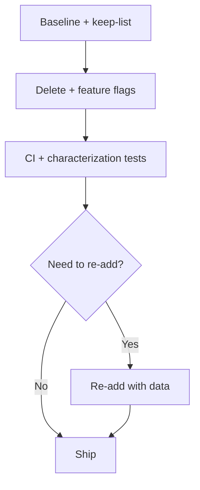

# Elon Musk

Delete-first refactoring. Shrink the system first, then optimize what survives.

## Executive Summary

1. Delete aggressively (often 70-90%) behind flags
2. Preserve externally required behavior (APIs, SLOs, safety controls)
3. Re-add only what measured outcomes require
4. Optimize after simplification
5. Automate last

## Preconditions

Do not run this playbook unless all are true:

1. CI is green
2. Characterization and contract tests exist for the target area
3. Feature flags and rollback path are ready
4. Owners for requirements and risk sign off

## Operating Order

1. Confirm requirement owners and explicit keep-list
2. Delete first (if little is deleted, challenge scope)
3. Simplify the remaining architecture
4. Optimize only measured bottlenecks
5. Automate only after process stability

## Git Safety Gates (Mandatory)

Before any large deletion:

1. Create an isolated branch: `refactor/<area>-delete-first`
2. Start from a clean working tree
3. Create a recoverable checkpoint:
   - lightweight tag: `pre-delete-<area>-<YYYYMMDD>`
   - optional backup branch: `backup/<area>-pre-delete`
4. Use small, reviewable commits with intent-first messages, for example:
   - `refactor!: delete deprecated parser path`
   - `test: add characterization coverage for billing flow`
5. Open small PRs with mandatory reviewers and green CI

Hard rules:

1. No deletion rampage on `main`
2. No force-push to shared branches during refactor
3. No removal of auth/audit/PII/security controls without explicit review and tests

## Workflow

1. Baseline
   - Capture current behavior, perf, and error metrics
   - Write keep-list: public APIs, SLOs, compliance/safety paths
2. Delete behind flags
   - Remove dead/duplicate/no-owner/untestable code first
   - Target large reduction (70-90%) where safe
3. Verify
   - Run characterization + contract tests
   - Enforce CI gates before merge
4. Decide with data
   - Re-add only if user impact, reliability, or contractual behavior requires it
5. Optimize survivors
6. Automate stable flow last

## Keep vs Delete Heuristic

Keep:

1. Public API and compatibility contracts
2. Safety/regulatory behavior
3. Proven hot paths with measurable value

Delete first:

1. Unused code
2. Duplicate logic
3. Code with no owner
4. Code impossible to test or reason about

## Rollback and Recovery

1. Every risky deletion is flag-guarded
2. Canary before full rollout
3. Be ready to revert by commit, tag, or backup branch
4. Record rollback steps directly in PR description

## Communication Contract

Every refactor PR should state:

1. Scope
2. Owner
3. Delete percentage target
4. Active flags
5. Rollback command/path
6. Expected impact (CI time, latency, crash rate, LOC delta)

## Estimation Heuristic

Rough planning baseline: 1-3 dev-days per 1k LOC touched (variance up to 2x).

## Example Flow

